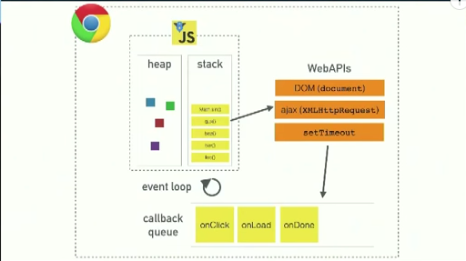
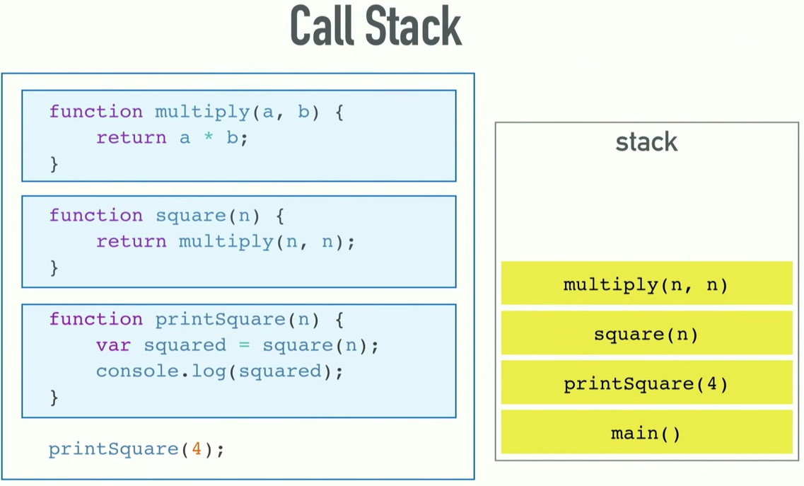
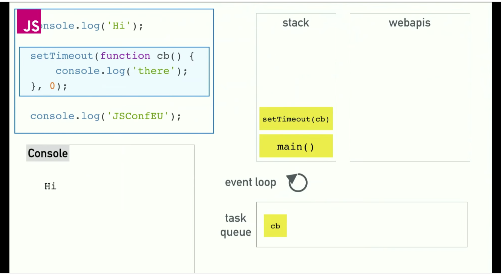
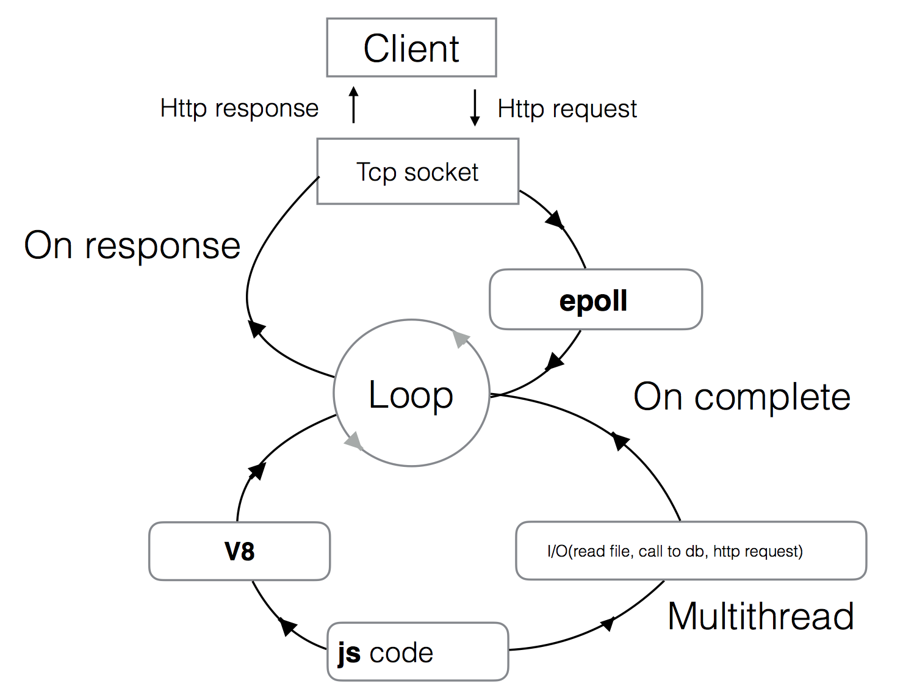

# Lesson 2. Event Loop, Timers, Express intro

----
## Lecture

**Video Link** [Webinar Video 2](https://youtu.be/o-uat-Oihkk) 

* Events — EventEmitter.
* Event Loop.
* libUV.
* timers, process.nextTick.
* fs module, working with file system.
* Introduction to Express.
* Practice: MockAPI app.

***Video timing***

----
### Event Loop

#### How does it works



#### Call stack



#### Task queue



* [Example 1](http://latentflip.com/loupe/?code=Y29uc29sZS5sb2coIlN0YXJ0ZWQhIik7CgokLm9uKCdidXR0b24nLCAnY2xpY2snLCBmdW5jdGlvbiBvbkNsaWNrKCkgewogICAgY29uc29sZS5sb2coJ1lvdSBjbGlja2VkIHRoZSBidXR0b24hJyk7ICAgIAp9KTsKCmNvbnNvbGUubG9nKCJIaSEiKTsKCnNldFRpbWVvdXQoZnVuY3Rpb24gdGltZW91dCgpIHsKICAgIGNvbnNvbGUubG9nKCJUaW1lb3V0IGZpbmlzaGVkISIpOwp9LCA1MDAwKTsKCmNvbnNvbGUubG9nKCJEb25lLiIpOw%3D%3D!!!PGJ1dHRvbj5DbGljayBtZSE8L2J1dHRvbj4%3D)
* [Example 2](http://latentflip.com/loupe/?code=c2V0VGltZW91dChmdW5jdGlvbiB0aW1lb3V0MSgpIHsKICAgIGNvbnNvbGUubG9nKCJUaW1lb3V0IDEiKTsKfSwgMTAwMCk7CgpzZXRUaW1lb3V0KGZ1bmN0aW9uIHRpbWVvdXQyKCkgewogICAgY29uc29sZS5sb2coIlRpbWVvdXQgMiIpOwp9LCAxMDAwKTsKCnNldFRpbWVvdXQoZnVuY3Rpb24gdGltZW91dDMoKSB7CiAgICBjb25zb2xlLmxvZygiVGltZW91dCAzIik7Cn0sIDEwMDApOwoKc2V0VGltZW91dChmdW5jdGlvbiB0aW1lb3V0NCgpIHsKICAgIGNvbnNvbGUubG9nKCJUaW1lb3V0IDQiKTsKfSwgMTAwMCk7!!!PGJ1dHRvbj5DbGljayBtZSE8L2J1dHRvbj4%3D)

**[Practice](http://latentflip.com/loupe/)**

```js
for(var i = 0; i < 10; i++) {
    setTimeout(function timer(){
        console.log(i);
    }, 0);
}

console.log("Welcome to loupe.");

```

----
### LibUV



* JS код выполняется в одном потоке.
* С++ код многопоточный и взаимодействует с JS кодом через коллбэки.
* Чем быстрее код, выполняемый в рамках одного event loop tick, тем быстрее проворачивается eventloop, тем больше операций можно совершить.
* Ожидание завершения асинхронной операции блокирует eventloop.


----
## Homework

Продолжаем делать наш mock сервер. В этот раз сделаем его более "живым".

## Задание 1

Сейчас `GET` endpoint `/users/` и `/posts/` возвращает статические json файлы.
Нужно переделать эти endpoint'ы так, чтобы они вычитывали содержимое подпапок в `users` и `posts` из файлов `get.json`,
И собирали ответ в массив.

```
/users
    /001
        get.json
            [{ "user": 1 }]
    /002
        get.json
            [{ "user": 2 }]
```

```
GET /api/1.0.1/users

[
    { "user": 1 },
    { "user": 2 }
]

```

Теперь для того чтобы добавить нового пользователя в ваши моки, вам нужно будет только добавить папку `003` и файл `get.json`.

## Задание 2

Сделать endpoints удаления живыми. (Для `users` и `posts`).

При запросе `DELETE /api/1.0.0/users/002` папка `002` из users должна быть удалена. При этом возвращается ответ 
пользователю:
 
```
[{
    "status": "success"
}]
```

В случае если такой папки (пользователя) не существует, то возвращаем код `404` и:
```
[{
    "status": "fail"
}]
```

## Задание 3 (Опционально)

Сделать endpoints добавления живыми. (Для `users` и `posts`).

Необходимо реалитзовать endpoints:

`POST /api/1.0.0/users/` и `POST /api/1.0.1/posts/`

Тело запроса должно собержать json. Например для постов:

```
[
    {
        "postId": "003",
        "imgUrl":"some-image.jpg",
        "likeCount":0,
        "description":"cool text",
        "userId":"003"
    }
]
```

В этом случае необходимо создать новый пост с `"postId": "003"`.
Создаем папку на сервере и записываем туда файл `get.json` с содержимым запроса.
 
В случае если такая папка у вас уже есть то возвращаем status `409` и
```
[{
    "status": "fail"
}]
```

## Задание 4 (Опционально)

Сделать обновление живым.

Необходимо реалитзовать endpoints:

`PUT /api/1.0.0/users/001` и `POST /api/1.0.1/posts/001`

Тело запроса должно собержать json. Например для постов:

```
[
    {
        "postId": "001",
        "imgUrl":"some-image1.jpg",
        "likeCount":1,
        "description":"cool text1",
        "userId":"003"
    }
]
```

В таком случае мы должны перезаписать файл `/posts/001/get.json`.


----
## Links

1. [Events doc](https://nodejs.org/dist/latest-v6.x/docs/api/events.html)
2. [Timer doc](https://nodejs.org/dist/latest-v6.x/docs/api/timers.html)
3. [FS doc](https://nodejs.org/dist/latest-v6.x/docs/api/fs.html)
4. [LibUV errors](https://github.com/libuv/libuv/blob/v1.x/include/uv.h)
