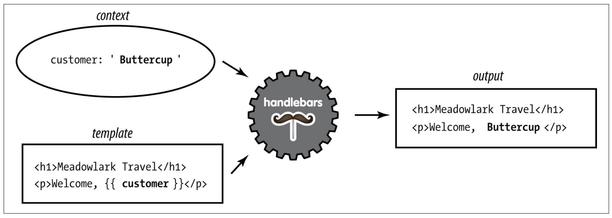

# Handlebars

### 1. Basics
```js
{ name: 'Buttercup' }
```

```html
<p>Hello, {{name}}!</p>
```

### 2. Html

```js
{ name: '<b>Buttercup</b>' }
```

```html
<p>Hello, {{{name}}}!</p>
```


### Context




### Comments 

```
{{! super-secret comment }}

<!-- not-so-secret comment -->
```


### Blocks

```
{
    currency: {
            name: 'United States dollars',
            abbrev: 'USD',
    }, tours: [
            { name: 'Hood River', price: '$99.95' },
            { name: 'Oregon Coast', price, '$159.95' },
    ],
    specialsUrl: '/january-specials',
    currencies: [ 'USD', 'GBP', 'BTC' ]
}
```

```
<ul>
    {{#each tours}}
        {{! I'm in a new block...and the context has changed }} 
        <li>
            {{name}} - {{price}}
            {{#if ../currencies}}
                    ({{../../currency.abbrev}})
            {{/if}}
        </li>
    {{/each}}
</ul>

{{#unless currencies}}
    <p>All prices in {{currency.name}}.</p>
{{/unless}}

{{#if specialsUrl}}
    {{! I'm in a new block...but the context hasn't changed (sortof) }}
    <p>Check out our <a href="{{specialsUrl}}">specials!</p> 
{{else}}
    <p>Please check back often for specials.</p> 
{{/if}}

<p>
    {{#each currencies}}
        <a href="#" class="currency">{{.}}</a>
    {{else}}
        Unfortunately, we currently only accept {{currency.name}}.
    {{/each}}
</p>
```
